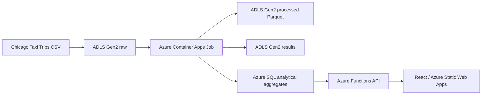

# Architecture



## Layers

- Dataset: public Chicago Taxi Trips CSV from Kaggle. The full dataset is never committed to Git.
- ADLS Raw: immutable source files organized by dataset and year.
- Container Apps Job: Python + Polars + PyArrow processing workload.
- ADLS Processed: cleaned and enriched Parquet partitioned for analytical processing.
- ADLS Results: aggregate Parquet and data quality summaries.
- Azure SQL: dashboard-ready aggregates only.
- Azure Functions API: stable HTTP contracts for the frontend.
- React / Static Web Apps: user interface; it never connects directly to Azure SQL.

## Data Lake layout

```text
raw/
└── chicago-taxi/
    └── 2023/
        └── taxi_trips.csv

processed/
└── chicago-taxi/
    └── year=2023/
        └── month=01/
            └── trips.parquet

results/
├── demand_by_hour.parquet
├── demand_by_area.parquet
├── payment_summary.parquet
├── monthly_trends.parquet
├── cost_by_distance.parquet
└── data_quality_summary.json
```

## Security posture

The future Azure implementation should prefer Managed Identity and RBAC. Secrets, connection strings, storage keys, datasets, CSV exports and Parquet outputs must not be committed.

